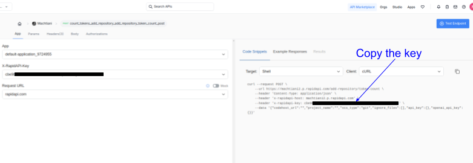

# machtiani

**Machtiani** is a command-line interface (CLI) tool designed to facilitate code chat and information retrieval from code repositories. It allows users to interact with their codebases by asking questions and retrieving relevant information from files in the project, utilizing language models for processing and generating responses. The aim is to support models aside from OpenAI, including open-source and self-hosted options.

[Join our discord server!](https://discord.gg/y3TR3d8Hxf)

***For now, it only work on GitHub projects you own or have push access to. If you don't have either, use it against a locally cloned fork that you own or have push rights to.***

1. **Add a git project**
   ```bash
   machtiani git-store --branch master
   ```

   Run `machtiani status` to check when it's done. It could take awhile to index and process depending on the size of the git project.

2. **Ask, direct...**
   ```bash
   machtiani "<your prompt>"
   ```
   

3. **Continue the chat**
   
   Directly edit the markdown chat convo in your preferred code editor. Let's ask it to create a setup script for TOTP 2-factor auth!
   
   
   
4. **Fire it off, again!***

   ```bash
   machtiani --file .machtiniani/chat/<chat>.md
   ```
   


   You can also run it based purely on the chat, without file retrieval.

   ```bash
   machtiani --file .machtiniani/chat/<chat>.md --mode pure-chat
   ```

5. **Sync latest commit changes to machtiani**
   ```bash
   machtiani git-sync --branch-name "<default-branch>"
   ```

**Check if you git-store is wrapped up**
```bash
   machtiani status
   ```
## Setup and Installation Instructions

### Get Machtiani API Key

1. Go to [RapidAPI](https://rapidapi.com/hub).

   You'll have to sign up here if you don't have a RapidAPI account.

2. Go to the [machtiani listing](https://rapidapi.com/machtiani-chat-machtiani-chat-default/api/machtiani2/pricing)

   Select the plan you want. After selection, you'll be redirected to your X-Rapid-API-Key (or go [here](https://rapidapi.com/machtiani-chat-machtiani-chat-default/api/machtiani2/playground/apiendpoint_ad97af86-a38b-455f-a488-c72aab891378) to get the key after signing up for a plan).

   

### Install

You can use either `curl` or `wget` to download and run the script in a single command:

#### Using `curl`
```bash
curl -L https://raw.githubusercontent.com/turbosource-marialis/machtiani-releases/main/install.sh | bash
```

#### Using `wget`
```bash
wget -O - https://raw.githubusercontent.com/turbosource-marialis/machtiani-releases/main/install.sh | bash
```

### Post-Installation

- The binary will be installed in `~/.local/bin/machtiani`.
- If `~/.local/bin` is not in your `PATH`, the script will offer to automatically add it to your `.bashrc` or `.zshrc`. Alternatively, you can manually add it by appending this line to your shell configuration file:
  ```bash
  export PATH=\$PATH:$HOME/.local/bin
  ```
  After making the change, either restart your terminal or run:
  ```bash
  source ~/.bashrc  # for bash
  source ~/.zshrc   # for zsh
  ```

### Configure

Edit the `~/.machtiani-config.yml`. You'll need an Github API key and OpenAI.

```yaml
environment:
  API_GATEWAY_HOST_VALUE: "Your Rapid API Key"
  CODE_HOST_API_KEY: "Your Github API Key"
  MODEL_API_KEY: "Your OpenAI API Key"
  MACHTIANI_URL: "https://machtiani2.p.rapidapi.com"
  MACHTIANI_REPO_MANAGER_URL: "https://machtiani2.p.rapidapi.com"
  API_GATEWAY_HOST_KEY: "X-RapidAPI-Key"
  CONTENT_TYPE_KEY: "Content-Type"
  CONTENT_TYPE_VALUE: "application/json"
```

***Only edit the following fields.***

**1. API_GATEWAY_HOST_VALUE**

The Rapid API Key you got from [subscribing](https://rapidapi.com/machtiani-chat-machtiani-chat-default/api/machtiani2/playground/apiendpoint_ad97af86-a38b-455f-a488-c72aab891378).

This is not `API_GATEWAY_HOST_KEY` field. You are placing your Rapid API key in `API_GATEWAY_HOST_VALUE`.

**2. CODE_HOST_API_KEY**

Your GitHub API key must have repo scopes, so `machtiani` can pull GitHub code to process. It also tests push access (but doesn't push any changes) to prevent users from chatting with projects that don't belong to them.

**3. MODEL_API_KEY**

Your OpenAI API key.

**WARNING: you are responsible for any costs incured for your requests with your OpenAI API key. Although machtiani cli does provide estimates of token usage for storing and syncing as a courtesy, it's only an estimate of input token usage and not ouptut. There are no guarantees as to its accuracy and it uses a generalized formula to approximate a wide range of tokens from different tokenizers, not specificially OpenAI's. Furthermore, there is no estimate for input or output for prompt operations. It's recommended you set usage limits directly with OpenAPI to avoid unexpected costs.**

The plan is to make it work with other models, especially self-hosted ones.

### Uninstall
To remove the `machtiani` tool, simply delete the binary:
```bash
rm ~/.local/bin/machtiani
```

## Go CLI Usage

### Overview

The `machtiani` CLI allows you to interact with the project through command-line parameters. You can provide a markdown file or a prompt directly via the command line, along with various options such as the project name, model type, match strength, and mode of operation.

### Command Structure

```bash
machtiani [flags] [prompt]
```

### Flags

- `-file string` (optional): Specify the path to a markdown file. If provided, the content of this file will be used as the prompt.
- `-project string` (optional): Name of the project. If not set, it will be fetched from Git.
- `-model string` (optional): Model to use. Options include `gpt-4o` or `gpt-4o-mini`. Default is `gpt-4o-mini`.
- `-match-strength string` (optional): Match strength options are `high`, `mid`, or `low`. Default is `mid`.
- `-mode string` (optional): Search mode, which can be `pure-chat`, `commit`, or `super`. Default is `commit`.
- `--force` (optional): Skip the confirmation prompt and proceed with the operation.

### Example Usage

1. **Providing a direct prompt:**
   ```bash
   machtiani "Add a new endpoint to get stats."
   ```

2. **Using an existing markdown chat file:**
   ```bash
   machtiani --file .machtiani/chat/add_state_endpoint.md
   ```

3. **Specifying additional parameters:**
   ```bash
   machtiani "Add a new endpoint to get stats." --model gpt-4o --mode pure-chat --match-strength high
   ```

4. **Using the `--force` flag to skip confirmation:**
   ```bash
   machtiani git-store --branch master --force
   ```

### Different Modes

In `commit` mode, it searches commits for possible files to help answer the prompt. In `pure-chat` mode, it does not retrieve any files.

#### `git-store`

The `git-store` command allows you to add a repository to the Machtiani system.

**Usage:**
```bash
machtiani git-store --branch <default_branch> --remote <remote_name> [--force]
```

**Example:**
```bash
machtiani git-store --branch master --force
```

#### `git-sync`

The `git-sync` command is used to fetch and checkout a specific branch of the repository.

**Usage:**
```bash
machtiani git-sync --branch <default_branch> --remote <remote_name> [--force]
```

**Example:**
```bash
machtiani git-sync --branch main --force
```

### `git-delete`

The `git-delete` command allows you to remove a repository from the Machtiani system. It won't delete your local git or remote.

**Usage:**
```bash
machtiani git-delete [--force]
```

**Example:**
```bash
machtiani git-delete
```

### Ignoring Files with `.machtiani.ignore`

***For now, you'll have to specify the full path of every file. No pattern-matching or ignoring a full directory of files. For now!***
You can ignore any binary files by providing the full path, such as images, etc. To exclude specific files from being processed by the application, you can create a `.machtiani.ignore` file in the root of your project directory. The files listed in this file will be ignored during the retrieval process.

#### Example `.machtiani.ignore` file:
```
poetry.lock
go.sum
go.mod
```

## How it Works

Machtiani employs a clever document retrieval algorithm that reduces the total code file search to improve efficiency.

Currenlty, machtiani is tightly coupled to git and employs a clever strategy to compress the file retrieval stage, making it usable on very large projects. There are rough edges (silent errors in places) and estimated input tokens is off when syncing and storing, but it works great in our experience and machtiani project was built with machtiani.

Although we want to say it's not yet ready for larger projects, we have experimented with it on projects with over 1400 versioned files, with no noticeable difference in accuracy from projects with only a few files. In the rare occurrence (more likely with larger projects) of errors when trying to chat from context getting exeeded, run your chat commands with `--match-strength high`.


To fully utilize Machtiani for effective document retrieval, it is essential to have concise, informative, and atomic Git commit messages. If your commit messages do not meet this criterion, we recommend using the CLI tool [aicommit](https://github.com/coder/aicommit), which is designed to assist in generating appropriate commit messages.

Machtiani currently relies on OpenAI's `text-embedding-3-large` for embedding and uses `gpt-4o-mini` for inference by default. Users can optionally choose `gpt-4o` for inference by using the `--model` flag. Note that this API usage incurs costs. There is a cost estimator in the works, but users should be aware that for projects with several hundred commits to be indexed and a large number of retrieved files, this may incur higher OpenAI usage costs.

It is important to note that Machtiani may not effectively handle repositories with a large number of commits, potentially limiting access to the full history of a repository.

Additionally, while Machtiani aims to improve the relevance of retrieved files, there may still be instances where unrelated files are returned, requiring further refinement in the dynamic match-strength algorithm.
