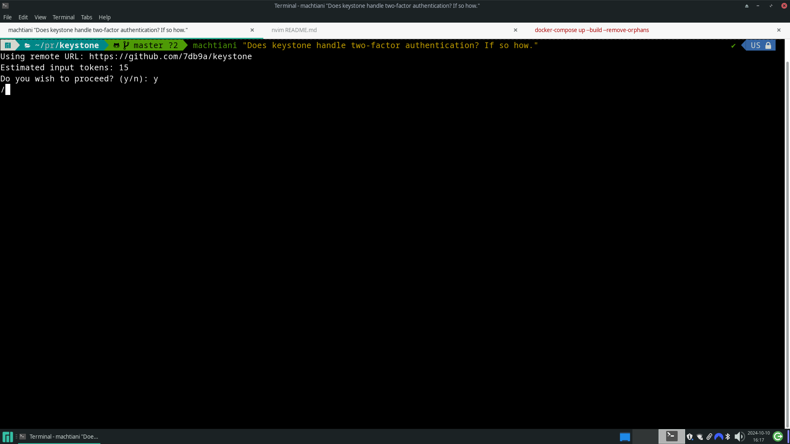
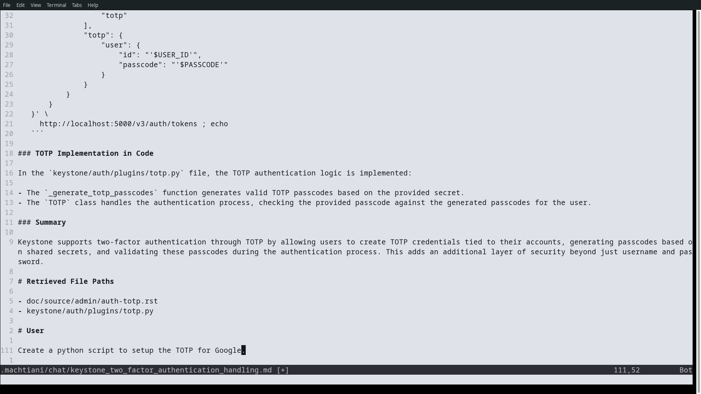
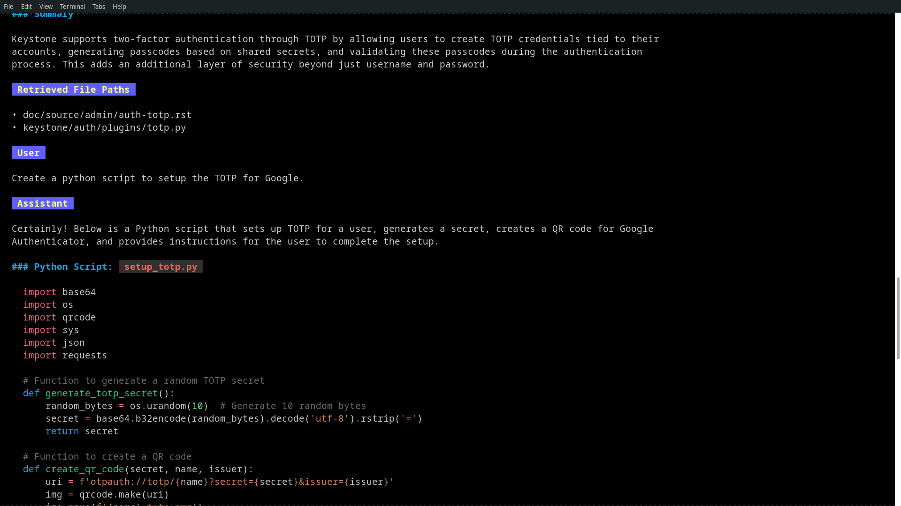

# machtiani

**Machtiani** is a command-line interface (CLI) tool designed to facilitate code chat and information retrieval from code repositories. It allows users to interact with their codebases by asking questions and retrieving relevant information from files in the project, utilizing language models for processing and generating responses. The aim is to support models aside from OpenAI, including open-source and self-hosted options.

1. **Add a git project**
   ```bash
   machtiani git-store --branch master
   ```

2. **Ask, direct...**
   ```bash
   machtiani "<your prompt>"
   ```
   

3. **Continue the chat**
   
   Directly edit the markdown chat convo in your preferred code editor. Let's ask it to create a setup script for TOTP 2-factor auth!
   
   
   
4. **Fire it off, again!***

   ```bash
   machtiani --file .machtiniani/chat/<chat>.md
   ```
   

5. **Sync up latest changes to project**
   ```bash
   machtiani git-sync --branch-name "<default-branch>"
   ```

## How it Works

Machtiani is tightly coupled to git and employs a clever strategy to compress the file retrieval stage, making it usable on very large projects. There are rough edges (silent errors in places) and estimated input tokens is off when syncing and storing, but it works great in our experience and machtiani project was built with machtiani.

Although we want to say it's not yet ready for larger projects, we have experimented with it on projects with over 1400 versioned files, with no noticeable difference in accuracy from projects with only a few files. In the rare occurrence (more likely with larger projects) of errors when trying to chat from context getting exeeded, run your chat commands with `--match-strength high`.

## Installation Instructions

You can use either `curl` or `wget` to download and run the script in a single command:

### Using `curl`
```bash
curl -L https://raw.githubusercontent.com/turbosource-marialis/machtiani-releases/main/install.sh | bash
```

### Using `wget`
```bash
wget -O - https://raw.githubusercontent.com/turbosource-marialis/machtiani-releases/main/install.sh | bash
```

### Post-Installation

- The binary will be installed in `~/.local/bin/machtiani`.
- If `~/.local/bin` is not in your `PATH`, the script will offer to automatically add it to your `.bashrc` or `.zshrc`. Alternatively, you can manually add it by appending this line to your shell configuration file:
  ```bash
  export PATH=\$PATH:$HOME/.local/bin
  ```
  After making the change, either restart your terminal or run:
  ```bash
  source ~/.bashrc  # for bash
  source ~/.zshrc   # for zsh
  ```

### Configure

Edit the `~/.machtiani-config.yml`.

```yaml
environment:
  MODEL_API_KEY: "your-openai-api-key"
  CODE_HOST_API_KEY: "your-github-key"
  MACHTIANI_URL: "http://localhost:5071"
  MACHTIANI_REPO_MANAGER_URL: "http://localhost:5070"
  API_GATEWAY_HOST_KEY: "x-api-gateway-host"
  API_GATEWAY_HOST_VALUE: "your-api-gateway-value"
  CONTENT_TYPE_KEY: "Content-Type"
  CONTENT_TYPE_VALUE: "application/json"
```

**CODE_HOST_API_KEY**

Your GitHub API key must have repo scopes, so `machtiani` can pull GitHub code to process. It also tests push access (but doesn't push any changes) to prevent users from chatting with projects that don't belong to them.

**MODEL_API_KEY**

Your OpenAI API key. The plan is to make it work with other models, especially self-hosted ones.

### Uninstall
To remove the `machtiani` tool, simply delete the binary:
```bash
rm ~/.local/bin/machtiani
```

## Go CLI Usage

### Overview

The `machtiani` CLI allows you to interact with the project through command-line parameters. You can provide a markdown file or a prompt directly via the command line, along with various options such as the project name, model type, match strength, and mode of operation.

### Command Structure

```bash
machtiani [flags] [prompt]
```

### Flags

- `-file string` (optional): Specify the path to a markdown file. If provided, the content of this file will be used as the prompt.
- `-project string` (optional): Name of the project. If not set, it will be fetched from Git.
- `-model string` (optional): Model to use. Options include `gpt-4o` or `gpt-4o-mini`. Default is `gpt-4o-mini`.
- `-match-strength string` (optional): Match strength options are `high`, `mid`, or `low`. Default is `mid`.
- `-mode string` (optional): Search mode, which can be `pure-chat`, `commit`, or `super`. Default is `commit`.
- `--force` (optional): Skip the confirmation prompt and proceed with the operation.

### Example Usage

1. **Providing a direct prompt:**
   ```bash
   machtiani "Add a new endpoint to get stats."
   ```

2. **Using an existing markdown chat file:**
   ```bash
   machtiani --file .machtiani/chat/add_state_endpoint.md
   ```

3. **Specifying additional parameters:**
   ```bash
   machtiani "Add a new endpoint to get stats." --model gpt-4o --mode pure-chat --match-strength high
   ```

4. **Using the `--force` flag to skip confirmation:**
   ```bash
   machtiani git-store --branch master --force
   ```

### Different Modes

In `commit` mode, it searches commits for possible files to help answer the prompt. In `pure-chat` mode, it does not retrieve any files.

#### `git-store`

The `git-store` command allows you to add a repository to the Machtiani system.

**Usage:**
```bash
machtiani git-store --branch <default_branch> --remote <remote_name> [--force]
```

**Example:**
```bash
machtiani git-store --branch master --force
```

#### `git-sync`

The `git-sync` command is used to fetch and checkout a specific branch of the repository.

**Usage:**
```bash
machtiani git-sync --branch <default_branch> --remote <remote_name> [--force]
```

**Example:**
```bash
machtiani git-sync --branch main --force
```

### `git-delete`

The `git-delete` command allows you to remove a repository from the Machtiani system.

**Usage:**
```bash
machtiani git-delete --remote <remote_name> [--force]
```

**Example:**
```bash
machtiani git-delete --remote origin --force
```

### Ignoring Files with `.machtiani.ignore`

You can ignore any binary files by providing the full path, such as images, etc. To exclude specific files from being processed by the application, you can create a `.machtiani.ignore` file in the root of your project directory. The files listed in this file will be ignored during the retrieval process.

#### Example `.machtiani.ignore` file:
```
poetry.lock
go.sum
go.mod
```
